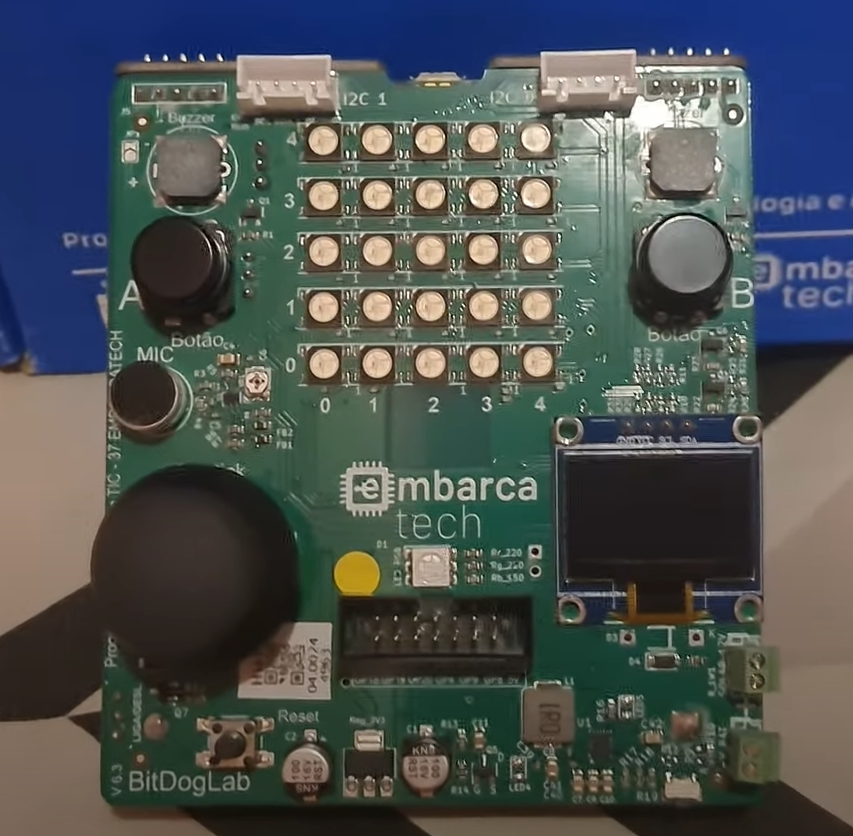

# ☢️ Roger Melo - HBr – Campinas 

Bem-vindo ao meu repositório! Aqui você encontrará todos os projetos que desenvolvi no curso **EmbarcaTech 2025**. 

---

## 🎯 Objetivo

Este repositório contém projetos desenvolvidos durante o curso **EmbarcaTech 2025**. Aqui, compartilho código-fonte, documentação e aprendizados adquiridos. 💡💻

---

## 📂 Projetos

🔹 [Projeto 1 - smart_strip](projetos/smart_strip) ⚡

---

## 🛠️ Meu Setup

> **Placa da BitDogLab**, utilizada para a realização dos projetos. 🔌✨

---

## 📖 Diário de Bordo

### 📅 Primeira Etapa
📌 **Resumo**: Na primeira etapa do programa **EmbarcaTech**, fomos desafiados a desenvolver um projeto!

🔹 **Aprendizados**:
- Configuração do ambiente de desenvolvimento 🖥️
- Primeiros passos com hardware embarcado 🔩
- Desafios e soluções na prototipação 🔧

*(Diário de Bordo será atualizado conforme o progresso! 📌)*

---
