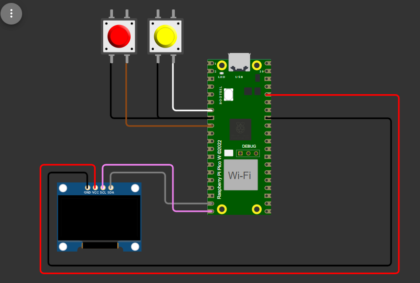
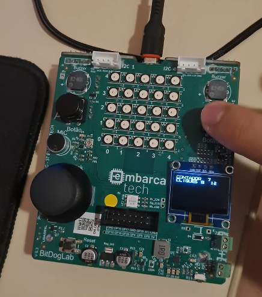

# Contador decrescente com registro de eventos por interrupção

## 🎯 Objetivo do Projeto

Explicação da Lógica da Tarefa

Faça um programa, em linguagem C, que implemente um contador decrescente controlado por interrupção, com o seguinte comportamento:

Toda vez que o Botão A (GPIO5) for pressionado:
O contador decrescente reinicia em 9 e o valor da contagem é mostrado no display OLED.
O sistema entra em modo de contagem regressiva ativa, decrementando o contador de 1 em 1 a cada segundo até chegar em zero.
Durante essa contagem (ou seja, de 9 até 0), o programa deve registrar quantas vezes o Botão B (GPIO6) foi pressionado. O valor deste registro de eventos de botão pressionado também deve ser mostrado no display OLED.
Quando o contador atingir zero, o sistema congela e ignora temporariamente os cliques no Botão B (eles não devem ser acumulados fora do intervalo ativo).
O sistema permanece parado após a contagem, exibindo:
O valor 0 no contador
A quantidade final de cliques no Botão B registrados durante o período de 9 segundo (contagem regressiva)
Somente ao pressionar novamente o Botão A, o processo todo se reinicia:
O contador volta para 9
O número de cliques do Botão B é zerado
A contagem recomeça do início

## 🧩 Componentes Usados
- **Microcontrolador**: Raspberry Pi Pico W RP2040
- **Display OLED**: 128x64 I2C
- **Botões de Pulso**: Para solicitar passagem
- **Fonte de Alimentação**: 5V via USB ou 3.3V interna

## ⚡ Pinagem dos Dispositivos
- **GPIO (Botões)**: 
  - Botão A: GPIO 5
  - Botão B: GPIO 6
  - Configurados como entrada com pull-up.
- **I2C (Display OLED)**:
  - SDA: GPIO 14
  - SCL: GPIO 15

## 🧪 Como Compilar e Executar
1. **Instalar dependências**:
   - Certifique-se de ter o ambiente de desenvolvimento adequado para o Raspberry Pi Pico.
   - Instale as bibliotecas necessárias para a comunicação I2C e controle dos GPIOs.

2. **Compilar o código**:
   - Compile o código-fonte utilizando a ferramenta o vscode

3. **Carregar para o dispositivo**:
   - Conecte o Raspberry Pi Pico ao seu computador via USB e carregue o código compilado para o dispositivo.

## 🖼️ Imagens e Vídeos

[Assista ao vídeo do projeto](https://www.youtube.com/shorts/SDqPEH9o-EU)

## 📝 Especificações Técnicas
- **Alimentação**: 5V via USB ou 3.3V interna.
- **Microcontrolador**: RP2040, dual-core ARM Cortex-M0+ a 133 MHz, 264 KB de RAM.
- **Display**: OLED 128x64 I2C, endereço 0x3C.
- **Botões**: Pull-up interno, leitura em GPIO.

