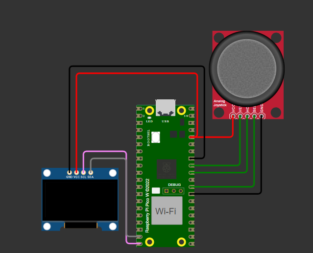
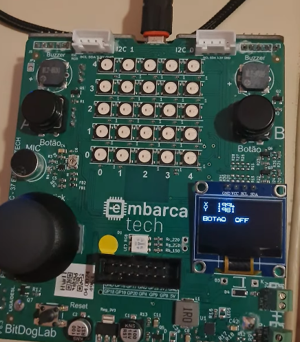

# Leitura Analógico-Digital

## 🎯 Objetivo do Projeto

Explicação da Lógica da Tarefa

Faça um programa em C para ler os valores convertidos digitalmente do joystick da BitDogLab. Os valores podem ser mostrados no terminal ou então no display OLED.

## 🧩 Componentes Usados
- **Microcontrolador**: Raspberry Pi Pico W RP2040
- **Display OLED**: 128x64 I2C
- **Joystick 
- **Fonte de Alimentação**: 5V via USB ou 3.3V interna

## ⚡ Pinagem dos Dispositivos
- **GPIO (Botões)**: 
  
  - Configurados como entrada com pull-up.
- **I2C (Display OLED)**:
  - SDA: GPIO 14
  - SCL: GPIO 15
- **Joystick**
  - vRx: GPIO 26 (ADC0)
  - vRy: GPIO 27 (ADC1)
  - Botão Joystick: GPIO 22

## 🧪 Como Compilar e Executar
1. **Instalar dependências**:
   - Certifique-se de ter o ambiente de desenvolvimento adequado para o Raspberry Pi Pico.
   - Instale as bibliotecas necessárias para a comunicação I2C e controle dos GPIOs.

2. **Compilar o código**:
   - Compile o código-fonte utilizando a ferramenta o vscode

3. **Carregar para o dispositivo**:
   - Conecte o Raspberry Pi Pico ao seu computador via USB e carregue o código compilado para o dispositivo.

4. **Execução**:
   - Após o código ser carregado no Raspberry Pi Pico, o sistema começará a funcionar automaticamente. 
   - Pressione os botões para solicitar a passagem de pedestres ou empilhadeiras, e observe os LEDs e a tela OLED exibindo o estado atual.

## 🖼️ Imagens e Vídeos

[Assista ao vídeo do projeto](https://youtube.com/shorts/kpS5aQkMO78)

## Resultados Esperados
- **Leitura analógica**: O joystick fornece valores entre 0 e 4095 nos eixos X e Y, referentes ao ADC de 12 bits do Pico W.  
- **Leitura digital**: O botão retorna 0 quando pressionado e 1 quando solto.  
- **Execução contínua**: Um loop infinito atualiza continuamente os valores lidos.

## 📝 Especificações Técnicas
- **Alimentação**: 5V via USB ou 3.3V interna.
- **Microcontrolador**: RP2040, dual-core ARM Cortex-M0+ a 133 MHz, 264 KB de RAM.
- **Display**: OLED 128x64 I2C, endereço 0x3C.
- **Joystick**

